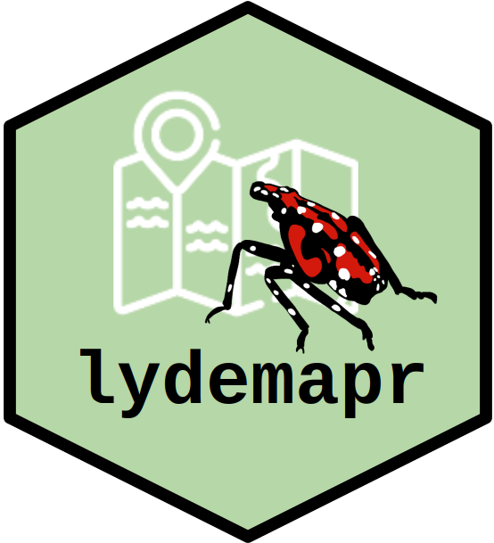

The Spotted Lanternfly (*Lycorma delicatula*, SLF) is an invasive pest species in the United States, first discovered in Berks County, PA, in 2014. Since its first discovery, several agencies (with the Pennsylvania Dept. of Agriculture, and the US Dept. of Agriculture in a leading role) have taken up the task to monitor and control SLF populations.

The package `lydemapr` combines survey datasets produced by different agencies in the United States (at the local, state, and federal level) into a single aggregated and anonymized dataset. This includes information on the approximate location where each survey was conducted, the provenance of the data point, as well as biologically relevant results of the surveys (presence/absence of the Spotted Lanternfly, presence of an established population, and estimated population density of this pest).

More information on how the package is structured and maintained can be found in the associated article De Bona et al. 2023 published in NeoBiota (see full citation below).

**IMPORTANT**: the current version of the package (v3) contains data beyond what described in the article, extending until early 2024.

#### Citation
De Bona, S., L. Barringer, P. Kurtz, J. Losiewicz, G.R. Parra, & M.R. Helmus. lydemapr: an R package to track the spread of the invasive spotted lanternfly (*Lycorma delicatula*, White 1845) (Hemiptera, Fulgoridae) in the United States. NeoBiota 86: 151-168. [https://doi.org/10.3897/neobiota.86.101471](https://doi.org/10.3897/neobiota.86.101471)


### How to use this project

There are three ways to obtain the package and the data associated with it.

#### 1. Downloading the data only

The data itself can be obtained separately by downloading any of the folders contained in `/download_data` directly form [this github page](https://github.com/ieco-lab/lydemap). Each folder within `/download_data` contains data from a separate version of the package, as indicated by their name. In addition, the suffix of the name indicates the last year of data included within the dataset. 

From the GitHub page, access `/download_data`, then the desired folder within, finally the file `lyde_data.zip`. To download it, click the download button on the right side of the page. The compressed file `lyde_data.zip` contains a folder with two version of the data in `.csv` format, alongside a Metadata file to understand and use the data.

In addition, the data is stored as a version-controlled repository on Zenodo (doi:10.5281/zenodo.7976229)

#### 2. Installing the package in R

The package `lydemapr` can be installed by the user in an instance of R or RStudio by typing.

```
require(devtools)
# install.packages("devtools") # if devtools is not installed yet
devtools::install_github("ieco-lab/lydemapr", build_vignettes = TRUE)
library(lydemapr)
```
At the user's discretion, the argument `build_vignettes` can be set to `FALSE` to prevent the vignettes from being rendered. A rendered pdf of the vignettes is included in the `download_data/` folder.


#### 3. Cloning the package locally

If the user wishes to access the full content of the package, they can clone `lydemapr` locally.
To do so, open your Terminal or git shell, and `cd` to the appropriate folder where you want the project to be stored. Then, type: 

```
git clone https://github.com/ieco-lab/lydemapr.git
```

Once the package is cloned, the content of the package can be accessed by opening the project file `lydemapr.Rproj` in RStudio. `lydemapr` can be installed directly in R through the Build tab, clicking "Install Package". Alternatively the user can type in the Console:

```
devtools::install(build_vignettes = TRUE)
```

This will generate a prompt asking whether the package dependencies should be updated. As mentioned above, the argument `build_vignettes` can be omitted (set to `FALSE` by default) to prevent the rendering of the package vignette. A rendered .pdf copy of the vignette is stored in the folder `download_data/`

#### 4. Accessing package documentation

The functions included in the package can be listed using

```
library(lydemapr)
ls("package:lydemapr")
```

The help file for any functions can be accessed through typing the function name preceded by a quotation mark, for example

```
?map_spread
```

Additionally, the package vignette, showcasing how the package functions can be used, can be accessed with

```
vignette("introduction", package = "lydemapr")
# NOTE! This will only work if the argument "build_vignettes = TRUE" was specified during installation
```
